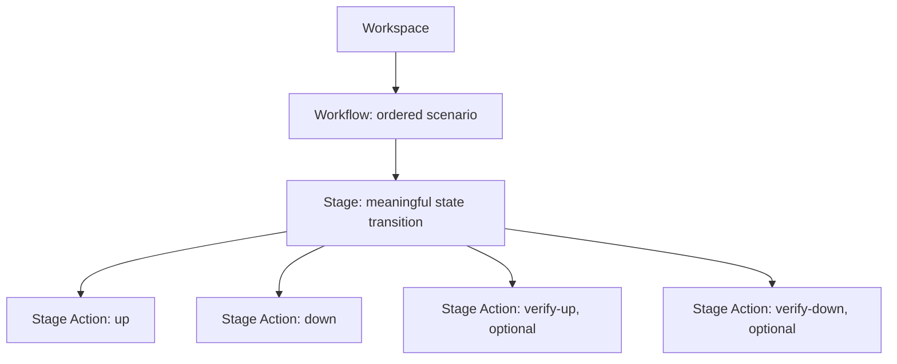
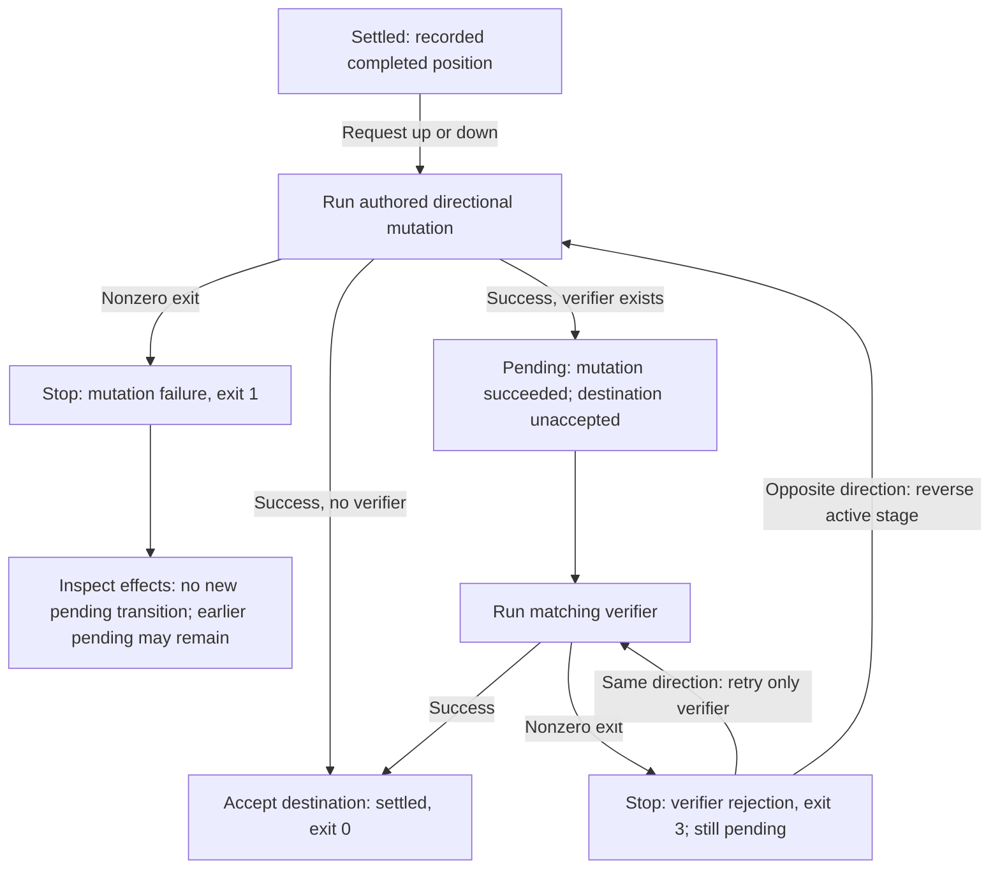

# Navigate and retry verification

A **completed stage** is Control Tower's last accepted, recorded position. A **pending transition** records that a mutation succeeded but its verifier has not succeeded. Both facts can be true at once; the stored position is not a claim that the external system remained unchanged.

Movement shows the workflow/target, then a flushed start and captured result for each actual Stage Action before the next starts. Its final completed stage, UUID and pending check use the same meaning as `status`. Output is buffered for one Stage Action, so the start identity may be the only output during a long operation. Success of a Stage Action does not by itself confirm the following checkpoint write.

Run CLI commands from the Workspace root and select the workflow with `--workflow`. Control Tower returns 0 for success/no-op, 1 for operational or mutation failure (including a verifier that cannot start), 2 for CLI usage errors, and 3 only when a verifier ran and rejected the transition. The child's own exit status is shown separately. Each movement ends with a factual summary of requested target, resulting position, and known pending/failed Stage Action details. On exit 3, inspect author-owned effects before retrying or reversing.

## Visual model



Each directional movement uses this lifecycle. The destination depends on the
direction: forward accepts a higher position; reverse accepts a lower one.
The diagram assumes checkpoint writes succeed. A save failure stops movement
with exit 1; inspect the last confirmed checkpoint and external effects as
described under [mutation and save failures](#a-mutation-failure-is-not-a-verifier-failure).



Reversal runs the authored opposite mutation and its optional verifier; it uses
the same failure and acceptance paths. A verifier that cannot start or has no
normal exit status is an operational failure (exit 1), and its transition remains
pending. Checkpoints are recorded metadata, not proof of current external state.
Cleanup is author-defined, not an automatic transaction. There is no standalone
verify command. These diagrams describe the shipped contract; the version-matched
CLI guides remain the agent source of truth. They were checked against
`operate_workflow` (CLI; Results and recovery) and `recover_workflow` (Pending
verification; Mutation or verifier process failure; Checkpoint save failure or
interruption).

## Move to a target

With the [three-stage example](../../examples/simple/workflows/uuid-file/README.md) prepared, run these from the copied simple example Workspace root with `control-tower` on `PATH`:

```sh
control-tower up --workflow workflows/uuid-file --stage 2
control-tower status --workflow workflows/uuid-file
control-tower up --workflow workflows/uuid-file --stage 3
control-tower down --workflow workflows/uuid-file --stage 2
```

The first command applies stages 1 and 2 if starting from baseline. The last reverses only stage 3. Every transition is ordered:

```text
stage N/up   -> optional stage N/verify-up   -> accept higher position
stage N/down -> optional stage N/verify-down -> accept lower position
```

An absent verifier adds no gate. A verifier that exists must pass before the destination is accepted. The next stage does not run until this one completes.

## Understand a failure

Suppose stage 2 is complete, stage 3/up succeeds, and stage 3/verify-up fails. Status should show:

```text
Completed stage: 2 (write-hello)
UUID: <the same run UUID>
Pending verification: up 3 (add-to-you)
Discovered stages: 3
```

This is representative output, not a stable machine-readable format. The file may already contain stage 3's mutation. You have two choices:

| Intent | Request | What runs |
| --- | --- | --- |
| Check stage 3 again after fixing the check or relevant application state | `up --stage 3` | Stage 3/verify-up only. The successful up does not run again. |
| Back out stage 3 | `down --stage 2` | Stage 3/down, then its optional verify-down. |

Changing application code does not itself redo the mutation. If you need to exercise the changed mutation, back out first and then run up again.

The failed movement prints runnable retry/backout commands using the current executable and workflow, with shell quoting for spaces/apostrophes. Their targets resolve only this active stage. For sparse stages 10/200, pending 200/up suggests up 200 or down 10; pending 200/down suggests down 10 or up 200. The lower side of the first stage is 0. A reverse command is offered only when that mutation exists.

Asking for `down --stage 1` first resolves stage 3's reversal, then reverses stage 2. It does not skip the unfinished stage.

## Try a verification failure

This single shell-only walkthrough reaches stage 2, rejects stage 3's verifier,
repairs and retries only the verifier, then reverses to baseline. A wrapper counts
stage 3's mutation so the retry proves that it ran only once. No backend, Python,
production data, or model subscription is needed to run the walkthrough.

Use a **fresh disposable copy**, not a workflow containing valuable test state.
Build with `cargo build --locked --workspace`, then run these blocks in order in
one Unix shell from the repository root. The temporary copy can be removed after
inspection; the wrapper and counter are disposable author-owned evidence outside
the fixture's `data/` directory.

```sh
set -eu
example="$(mktemp -d "${TMPDIR:-/tmp}/control-tower-uuid.XXXXXX")/simple"
cp -R examples/simple "$example"
workflow="$example/workflows/uuid-file"
binary="$PWD/target/debug/control-tower"
ct() { (cd "$example" && "$binary" "$@"); }
printf 'Walkthrough workflow: %s\n' "$workflow"
ct init --workflow workflows/uuid-file
ct up --workflow workflows/uuid-file --stage 2
ct status --workflow workflows/uuid-file
test "$(cat "$workflow"/data/*)" = 'hello'

stage="$workflow/stages/003-add-to-you"
cp "$stage/up" "$workflow/up.original"
cat > "$stage/up" <<'SH'
#!/bin/sh
set -eu
printf '%s %s\n' "$CONTROL_TOWER_STAGE" "$CONTROL_TOWER_ROLE" >> "$CONTROL_TOWER_WORKFLOW/mutation-calls"
exec "$CONTROL_TOWER_WORKFLOW/up.original"
SH
chmod +x "$stage/up" "$workflow/up.original"
check="$stage/verify-up"
cp "$check" "$workflow/verify-up.original"
printf '#!/bin/sh\nexit 23\n' > "$check"
chmod +x "$check"
```

Now deliberately reject verification. The conditional captures the expected
Control Tower exit 3 without stopping a shell using `set -e`; the child's exit
status is 23. Any other outcome fails the assertion:

```sh
if ct up --workflow workflows/uuid-file --stage 3; then
    rejected=0
else
    rejected=$?
fi
test "$rejected" -eq 3
ct status --workflow workflows/uuid-file
cat "$workflow"/data/*
printf '\n'
test "$(cat "$workflow"/data/*)" = 'hello to you'
test "$(cat "$workflow/mutation-calls")" = '3 up'
cat "$workflow/mutation-calls"
before="$(cat "$workflow"/data/*)"
```

The file contains `hello to you`, but completed position remains 2 with pending
up verification for stage 3. The counter contains exactly one `3 up` line.
Repair the verifier and request the same target:

```sh
cp "$workflow/verify-up.original" "$check"
chmod +x "$check"
ct up --workflow workflows/uuid-file --stage 3
test "$(cat "$workflow/mutation-calls")" = '3 up'
test "$(cat "$workflow"/data/*)" = "$before"
cat "$workflow/mutation-calls"
ct status --workflow workflows/uuid-file
```

Only stage 3/verify-up starts on retry. The count and fixture remain unchanged;
status now reports completed stage 3 with no pending verification.

Checks are optional and discovered afresh. Editing/removing a pending verifier changes what the next invocation runs; removing it can accept without a check or mutation replay. Preserve the check when you intend a verifier-only retry. An already settled target runs no Stage Actions and says so; it does not reverify external state.

Reverse to baseline:

```sh
ct down --workflow workflows/uuid-file --stage 0
ct status --workflow workflows/uuid-file
test -z "$(ls -A "$workflow/data")"
test "$(cat "$workflow/mutation-calls")" = '3 up'
```

The data directory is empty and status reports baseline (0) and `UUID: not
created`. The checkpoint database and disposable counter remain. To back out
while verification is still pending instead, request
`ct down --workflow workflows/uuid-file --stage 2`: stage 3/down and its optional
verify-down restore `hello`, then a downward request to 0 reverses the earlier
stages. The [retry/backout table](#understand-a-failure) describes this path.

## Downward and reverse verification

The same rules apply in both directions. If completed stage 3/down succeeds but its verify-down fails, completed stays 3. Another downward request retries only verify-down; an upward request toward 3 runs stage 3/up and its optional verifier.

Reversing an unfinished up has a different completed baseline. If stage 2 is complete, stage 3/up is pending, and stage 3/down succeeds but verify-down fails, completed stays **2**, with pending **down 3**. Another downward request retries only verify-down. The successful down is not repeated.

The UUID stays available in all these cases, including a pending return to baseline. It clears only when the workflow successfully settles at 0. SQLite retains this bookkeeping across separate CLI processes.

## A mutation failure is not a verifier failure

If `up` or `down` itself exits nonzero, Control Tower reports the failure and stops before the verifier or later stages. It does not infer whether the script partially changed something, automatically back it out, or provide a dedicated recovery flow. A failed reverse mutation can leave the prior pending checkpoint recorded; that is not evidence about the external state.

Verifier retry/backout recipes are printed only for this invocation's failed verifier. After a mutation or save failure, inspect author-owned effects. In particular, a partially effective failed first up can leave baseline, a retained UUID and no pending check. Down 0 then runs no cleanup; retrying up can repeat effects with the same UUID.

`down` reverses accepted workflow transitions. A failed mutation may leave an external
effect while its stage remains unaccepted, so normal traversal will not invoke that
stage's `down`. Recovery belongs to the workflow that owns the effect. In the
[Postgres example](../../examples/simple/workflows/postgres/README.md#failed-stage-002-retry-or-abandon),
stage 2 can commit its run-owned row and then fail writing a local receipt: completed
position stays at stage 1 and the UUID is retained. Repair/retry validates the same
row; abandonment requires explicit UUID-scoped SQL cleanup before returning to
baseline. Neither an earlier stage's reversal nor deleting checkpoint files performs
that cleanup.

After a save failure, the movement separates the last confirmed checkpoint from the attempted update, preserves Stage Action results, and stops. A pending-save failure can retain a successful mutation with no recorded pending check; a final-save failure can retain a pending check after the verifier succeeded. Those cases have different retry effects. No automatic retry/reconciliation is provided.

A Rust-process crash or SQLite failure likewise carries no external-state reconciliation guarantee. Do not treat a saved checkpoint as a transaction around an API/database mutation. See [troubleshooting](troubleshooting.md).

## Evidence

The [Application semantics tests](../../crates/application/tests/run_semantics.rs) check ordering and stored-position timing. The [CLI integrations](../../crates/cli/tests/workbench_cli.rs) cover the example and verifier retries/reversals across real processes with SQLite. The [example harness](../../examples/tests/test_ordinary_workflows.py) executes the shell blocks in the walkthrough above verbatim using a PATH without Python, asserts the rejected exit code, pending status, single mutation, unchanged fixture, and final baseline/UUID, and runs with `./examples/test --family simple`. The harness itself uses Python/pytest; the walkthrough does not. The [run-semantics validation](../research/run-semantics-validation.md) records executed tests and manual runs, with toolchain/platform limits.
