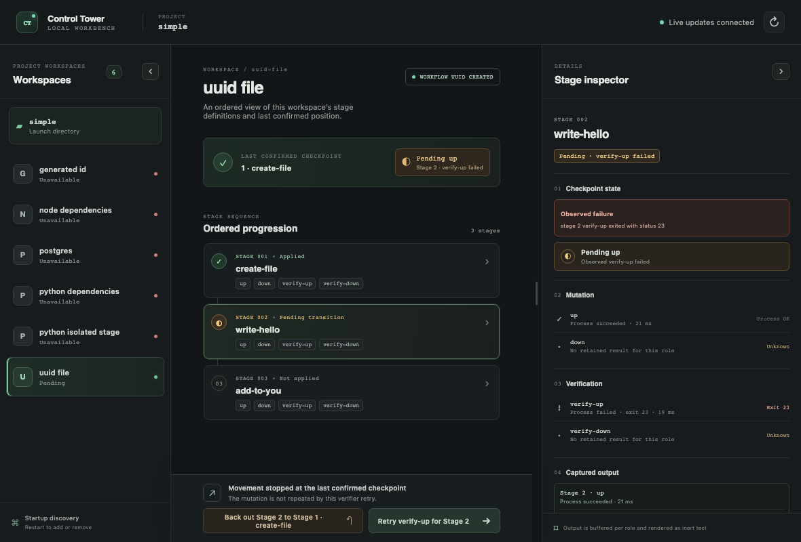
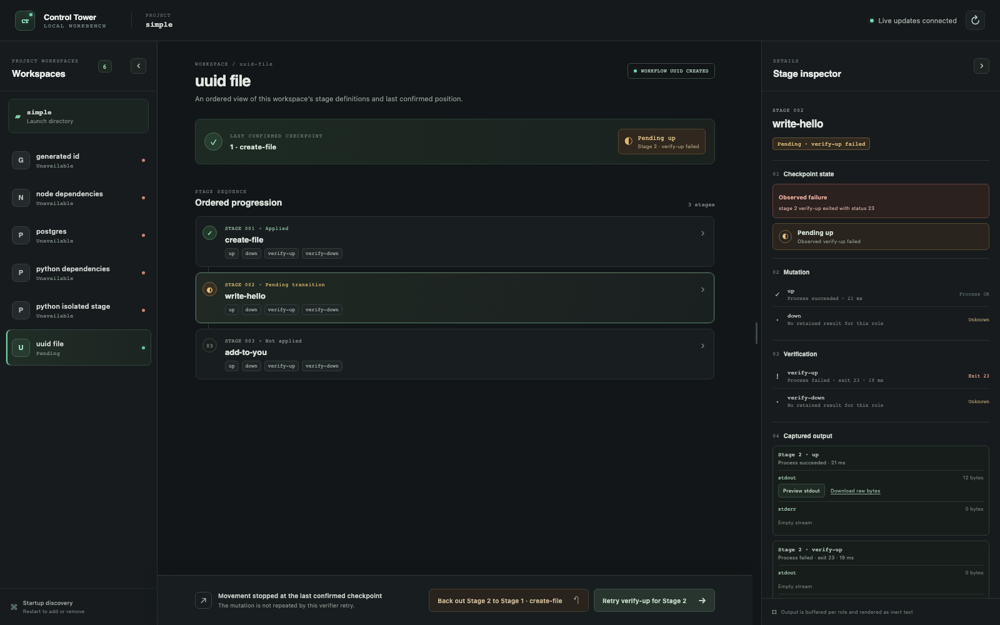

# macOS browser workbench delivery validation

## Environment and production path

Executed on macOS 26.6.2 arm64 with Google Chrome 153.0.8010.50. Rust 1.85.0
and 1.94.0 were both available. Node 22.13.1/npm 10.9.2 were used only for the
frontend build and browser checks.

The React production assets were rebuilt and embedded in a locked Rust release
build. Both executables were also installed into a temporary isolated Cargo root;
the installed `control-tower-db` prepared a copied `examples/simple` workspace,
and the installed `control-tower ui` opened the system browser from outside the
source checkout. The page title, startup discovery and prepared SQLite status
were visible in Chrome. No Vite server or Node hosting process served the UI.

The interactive owner walkthrough used another disposable complete copy of
`examples/simple`. Through the production UI in Chrome, it advanced stage 1,
advanced stage 2 into a deliberately controlled `verify-up` exit 23, retried
only verification, backed out stage 2, and returned stage 1 to baseline. The
inspector showed the mutation and verifier separately, exposed the failed
verifier output, and offered stage-specific retry/backout actions.

Fixture call records showed stage 2 `up` once and `verify-up` twice. They also
recorded the launch environment sentinel and each role's stage directory as its
working directory. Stage 2 backout ran its mutation and `verify-down`, then
stage 1 backout ran its mutation and `verify-down`. At the end the data directory
contained no UUID file; SQLite held completed stage count 0, null UUID, and no
pending transition. The final UI showed baseline.

## Browser screenshots

These implementation screenshots were captured with Playwright Chromium on the
production loopback host while the controlled verifier failure was pending. They
show the bundled UI at its documented minimum desktop width and at a larger
desktop viewport. They are product captures, separate from the publisher-owned
remote reference screenshots in the
[UI reference review](2026-10-02-ui-reference-review.md).

## Shutdown and automated checks

The first live shutdown check showed that an idle SSE connection could keep the
process alive after its listener closed. The Entry now signals SSE streams during
graceful shutdown. With Chrome still connected and the workspace idle, Ctrl-C
closed the SSE stream, exited the host process, and released its loopback listener.
The regression test covers stream closure and listener release.

Checks completed on the final source:

- `npm ci`, `npm run build`, and `npm test`: 30 frontend tests passed.
- `npm run test:browser`: 5 Chromium layout/reconciliation tests passed, including
  the minimum 1180 pixel desktop width, inspector resize/collapse, and another-tab
  observation update.
- `cargo fmt --all -- --check` and `cargo test --locked --workspace` passed with
  Rust 1.94.0 and Rust 1.85.0; the workspace suite contains 60 tests.
- `cargo build --locked --release --workspace` and isolated Cargo installs of
  `control-tower` and `control-tower-db` completed.
- The Rust Entry suite exercised loopback HTTP/SSE, disconnected movement
  requests, role output before a later role finishes, subscriber resynchronization,
  checkpoint-save faults, overlapping movement admission, and request protection.

On 2026-10-03, the four publisher image URLs in the
[UI reference review](2026-10-02-ui-reference-review.md) returned HTTP 200 with
image content types. They remain remotely hosted and attributed; no third-party
screenshot bytes were copied into the product.
